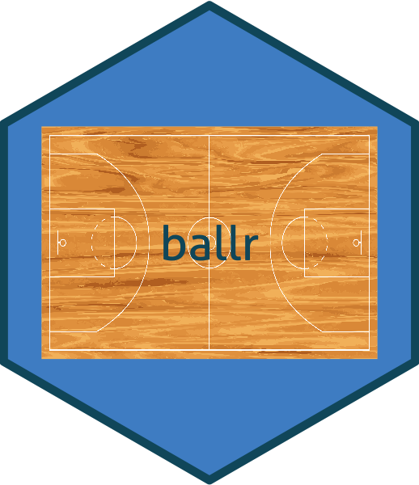

# ballr 

An R API for basketball-reference.com.  The correct pronounciation for this 
package is **baw**-ler. 

[](http://www.repostatus.org/#active)
[](https://travis-ci.org/rtelmore/ballr)
[](https://codecov.io/github/rtelmore/ballr?branch=master)
[](https://cran.r-project.org/package=ballr)
[](http://www.r-pkg.org/pkg/ballr)
[](https://zenodo.org/badge/latestdoi/45419870)

## To install

From CRAN:
```r
install.packages("ballr")
```

The development version from GitHub:
```r
install.packages("devtools")
library(devtools)
install_github("rtelmore/ballr")
```
 
